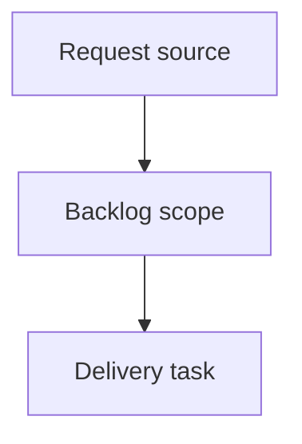

## item_001_ajouter_des_pages_epissures_aux_sorties_fdc - Ajouter des pages epissures aux sorties FDC
> From version: 0.1.0
> Schema version: 1.0
> Status: Done
> Understanding: 90%
> Confidence: 85%
> Progress: 100%
> Complexity: High
> Theme: Operator workflow and runtime integration
> Reminder: Update status/understanding/confidence/progress and linked request/task references when you edit this doc.

# Problem
Add an epissures worksheet area to every generated FDC workbook.
For each generated fil-a-fil worksheet, create a linked epissures worksheet that lists detected splices as simple 5-column tables.
Provide a first structured table output only; graphical splice drawings are explicitly out of scope for this request.

# Scope
- In:
  - collect splice endpoints from each generated cut-sheet source resolution set
  - create one associated epissures worksheet per generated cut-sheet worksheet
  - render one 5-column table per splice ID
  - put wires with splice in `End ID` on the left side, column 1
  - put wires with splice in `Begin ID` on the right side, column 5
  - apply simple ExcelJS styling: merged bold centered title, borders, widths, alignment, and two blank rows between tables
  - update `README.md` to document the new output
- Out:
  - graphical drawings with lines, arrows, connector blocks, or Excel shapes
  - changes to cable catalog resolution rules
  - changes to cut-sheet worksheet column mapping
  - broader UI or viewer work

# Acceptance criteria
- AC1: A generated workbook keeps all existing cut-sheet worksheets.
- AC2: For each generated cut-sheet worksheet, an associated epissures worksheet is created.
- AC3: Wires connected to the same splice ID are grouped in the same table.
- AC4: Wires where the splice is in `End ID` appear in column 1.
- AC5: Wires where the splice is in `Begin ID` appear in column 5.
- AC6: Each splice table title row is merged across 5 columns, bold, and centered.
- AC7: At least two blank rows separate two splice tables.
- AC8: `npm run check` passes.
- AC9: `npm run build` generates an Excel workbook that can be opened and contains the new epissures worksheets.
- AC10: `README.md` documents the new epissures output.

# AC Traceability
- request-AC1 -> This backlog slice. Proof: AC1: A generated workbook keeps all existing cut-sheet worksheets.
- request-AC2 -> This backlog slice. Proof: AC2: For each generated cut-sheet worksheet, an associated epissures worksheet is created.
- request-AC3 -> This backlog slice. Proof: AC3: Wires connected to the same splice ID are grouped in the same table.
- request-AC4 -> This backlog slice. Proof: AC4: Wires where the splice is in `End ID` appear in column 1.
- request-AC5 -> This backlog slice. Proof: AC5: Wires where the splice is in `Begin ID` appear in column 5.
- request-AC6 -> This backlog slice. Proof: AC6: Each splice table title row is merged across 5 columns, bold, and centered.
- request-AC7 -> This backlog slice. Proof: AC7: At least two blank rows separate two splice tables.
- request-AC8 -> This backlog slice. Proof: AC8: `npm run check` passes.
- request-AC9 -> This backlog slice. Proof: AC9: `npm run build` generates an Excel workbook that can be opened and contains the new epissures worksheets.
- request-AC10 -> This backlog slice. Proof: AC10: `README.md` documents the new epissures output.

# Decision framing
- Product framing: Not needed
- Product signals: (none detected)
- Product follow-up: No product brief follow-up is expected based on current signals.
- Architecture framing: Not needed
- Architecture signals: (none detected)
- Architecture follow-up: No architecture decision follow-up is expected based on current signals.

# Links
- Product brief(s): (none yet)
- Architecture decision(s): (none yet)
- Request: `req_000_pages_epissures_sorties_fdc`
- Primary task(s): `task_001_ajouter_des_pages_epissures_aux_sorties_fdc`

# AI Context
- Summary: Ajouter des pages epissures aux sorties FDC
- Keywords: backlog-groom, request, ajouter des pages epissures aux sorties fdc, bounded slice
- Use when: Use when implementing or reviewing the delivery slice for Ajouter des pages epissures aux sorties FDC.
- Skip when: Skip when the change is unrelated to this delivery slice or its linked request.

# Priority
- Impact: improves operator review of splice wiring directly in generated FDC workbooks.
- Urgency: requested as the next incremental output format improvement before attempting graphical splice diagrams.

# Notes
- Hybrid rationale: Derived from request `req_000_pages_epissures_sorties_fdc` and kept bounded to one coherent delivery slice.
- Source file: `logics/request/req_000_pages_epissures_sorties_fdc.md`.
- Generated locally by logics-manager.
- Implementation should prefer small helpers around the existing `isSpliceEndpoint`, `makeUniqueWorksheetName`, and ExcelJS worksheet-writing patterns.
- Task `task_001_ajouter_des_pages_epissures_aux_sorties_fdc` was finished via `logics-manager flow finish task` on 2026-06-18.

# Tasks
- `task_001_ajouter_des_pages_epissures_aux_sorties_fdc`
