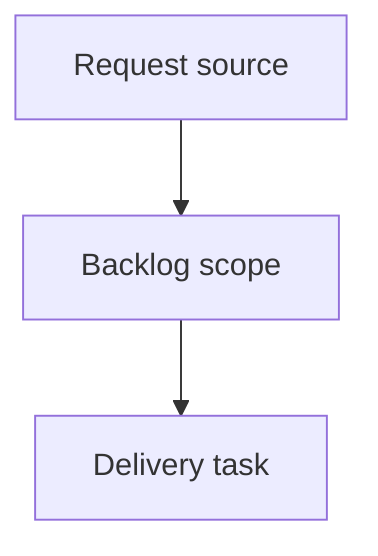

## item_002_ajouter_numerotation_et_traits_aux_epissures - Ajouter numerotation et traits aux epissures
> From version: 0.1.0
> Schema version: 1.0
> Status: Done
> Understanding: 90%
> Confidence: 85%
> Progress: 100%
> Complexity: High
> Theme: Operator workflow and runtime integration
> Reminder: Update status/understanding/confidence/progress and linked request/task references when you edit this doc.

# Problem
The first epissures worksheet output groups wires by splice, but the table is still hard to read as a splice schematic.
Operators need each side of the splice to show a local wire index and visual connector lines toward a central black splice marker.

# Scope
- In:
  - update the epissures worksheet writer
  - render each splice table as 5 columns: left number, left wire label, black center splice column, right number, right wire label
  - number left-side wires from 1 to N for each splice
  - number right-side wires from 1 to N for each splice
  - fill one central cell in column 3 in solid black around `ceil(max(left count, right count) / 2)`
  - draw or otherwise insert Excel-compatible connection lines from numbered rows toward the black center cell
  - keep existing cut-sheet worksheets and existing epissures worksheet creation
  - document any technical limitation or fallback for connector line rendering
- Out:
  - changing splice detection rules
  - changing `Begin ID`/`End ID` left-right assignment
  - changing cable catalog resolution
  - changing generated cut-sheet worksheet mapping
  - full graphical harness or connector block drawings

# Acceptance criteria
- AC1: Existing epissures worksheets are still generated one per cut-sheet worksheet.
- AC2: Each splice table uses a 5-column layout: left number, left wire label, center splice cell, right number, right wire label.
- AC3: Left-side rows are numbered `1, 2, 3...` independently for wires on the left side of the splice.
- AC4: Right-side rows are numbered `1, 2, 3...` independently for wires on the right side of the splice.
- AC5: The central splice cell in column 3 is filled solid black and placed around the midpoint of the side with the most wires.
- AC6: Visual connection lines are added from each numbered left-side row toward the center of the black splice cell.
- AC7: Visual connection lines are added from each numbered right-side row toward the center of the black splice cell.
- AC8: Existing grouping by splice ID and left/right assignment from `End ID`/`Begin ID` remains unchanged.
- AC9: The workbook opens in Excel/LibreOffice and the epissures worksheet layout is visible.
- AC10: Documentation or implementation notes explain any limitation or workaround used for Excel line rendering.

# AC Traceability
- request-AC1 -> This backlog slice. Proof: AC1 keeps the one epissures worksheet per cut-sheet worksheet behavior.
- request-AC2 -> This backlog slice. Proof: AC2 defines the 5-column refined splice table layout.
- request-AC3 -> This backlog slice. Proof: AC3 defines independent left-side row numbering.
- request-AC4 -> This backlog slice. Proof: AC4 defines independent right-side row numbering.
- request-AC5 -> This backlog slice. Proof: AC5 defines the black central splice cell placement.
- request-AC6 -> This backlog slice. Proof: AC6 defines left-side connector lines.
- request-AC7 -> This backlog slice. Proof: AC7 defines right-side connector lines.
- request-AC8 -> This backlog slice. Proof: AC8 preserves existing splice grouping and side assignment.
- request-AC9 -> This backlog slice. Proof: AC9 requires the generated workbook to open with visible layout.
- request-AC10 -> This backlog slice. Proof: AC10 requires documentation or notes for line rendering limits/workarounds.

# Decision framing
- Product framing: Not needed
- Product signals: (none detected)
- Product follow-up: No product brief follow-up is expected based on current signals.
- Architecture framing: Not needed
- Architecture signals: (none detected)
- Architecture follow-up: No architecture decision follow-up is expected based on current signals.

# Links
- Product brief(s): (none yet)
- Architecture decision(s): (none yet)
- Request: `req_001_ajouter_numerotation_et_traits_aux_epissures`
- Primary task(s): `task_002_ajouter_numerotation_et_traits_aux_epissures`

# AI Context
- Summary: Ajouter numerotation et traits aux epissures
- Keywords: backlog-groom, request, ajouter numerotation et traits aux epissures, bounded slice
- Use when: Use when implementing or reviewing the delivery slice for Ajouter numerotation et traits aux epissures.
- Skip when: Skip when the change is unrelated to this delivery slice or its linked request.

# Priority
- Impact: improves operator readability of splice pages by making each side indexed and visually linked to the splice center.
- Urgency: next incremental refinement after structured epissures tables; should be handled before larger graphical splice drawings.

# Notes
- Hybrid rationale: Derived from request `req_001_ajouter_numerotation_et_traits_aux_epissures` and kept bounded to one coherent delivery slice.
- Source file: `logics/request/req_001_ajouter_numerotation_et_traits_aux_epissures.md`.
- Generated locally by logics-manager.
- Implementation should first validate whether ExcelJS can emit connector line shapes. If not, choose the smallest Excel-compatible fallback that still makes the connectors visible and document it.
- Task `task_002_ajouter_numerotation_et_traits_aux_epissures` was finished via `logics-manager flow finish task` on 2026-06-18.

# Tasks
- `task_002_ajouter_numerotation_et_traits_aux_epissures`
