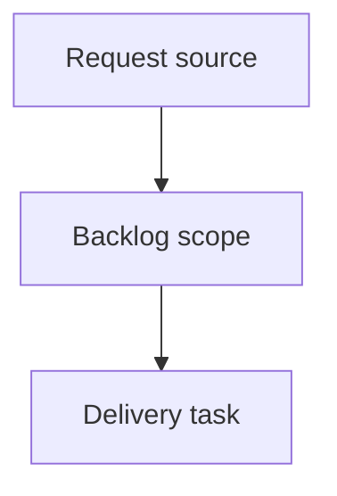

## item_003_corriger_detection_gauche_droite_des_epissures_et_numero_de_fil_affiche - Corriger detection gauche droite des epissures et numero de fil affiche
> From version: 0.1.0
> Schema version: 1.0
> Status: Done
> Understanding: 90%
> Confidence: 85%
> Progress: 100%
> Complexity: High
> Theme: Operator workflow and runtime integration
> Reminder: Update status/understanding/confidence/progress and linked request/task references when you edit this doc.

# Problem
Corriger la detection du cote (gauche/droite) des fils d'une epissure dans les onglets `Epissures` generes.
Afficher dans les tables d'epissures le meme numero de fil que la colonne `FIL` de la feuille de coupe, et non le `Technical ID` complet.
Ajouter, dans la mise en page 5 colonnes maison existante, une precision visuelle pour les epissures torsadees.

# Scope
- In:
  - one coherent delivery slice from the source request
- Out:
  - unrelated sibling slices that should stay in separate backlog items instead of widening this doc

# Acceptance criteria
- AC1: Le cote gauche/droite d'un fil d'epissure est determine par le pin `L`/`R` de l'extremite epissure, pas par la position `Begin ID`/`End ID`.
- AC2: Sur `LAT-EP-01`, la sortie generee place `LAT-W-001`, `-002`, `-026`, `-027` a gauche et `LAT-W-004`, `-031`, `-003` a droite.
- AC3: Un pin qui n'est ni `L` ni `R` ne produit pas de placement devine : un flag est remonte et un repli deterministe documente est applique.
- AC4: Les etiquettes des tables d'epissures affichent le numero `FIL` entier, identique a la colonne 2 de la feuille de coupe du meme fil.
- AC5: Le numero affiche est derive avec la meme logique que la feuille de coupe (`parseTechnicalIdWireNumber`), avec repli documente quand l'extraction echoue.
- AC6: Les fils torsades sont visuellement distingues dans la table d'epissure (marqueur deduit de `Twist group`), en conservant la grille 5 colonnes maison.
- AC7: Regroupement par ID d'epissure, numerotation 1-based par cote, cellule centrale noire et traits de liaison restent fonctionnels avec les cotes corriges.
- AC8: La reference d'epissure et les manchons NE sont PAS ajoutes (hors perimetre).
- AC9: `README.md` et les regles/AC heritees decrivant la detection de cote (`req_000` AC4/AC5, `req_001` AC8) sont mises a jour pour refleter la regle par pin.
- AC10: `npm run check` et `npm run build` passent et le classeur genere s'ouvre avec les onglets d'epissures corriges.

# AC Traceability
- request-AC1 -> This backlog slice. Proof: AC1: Le cote gauche/droite d'un fil d'epissure est determine par le pin `L`/`R` de l'extremite epissure, pas par la position `Begin ID`/`End ID`.
- request-AC2 -> This backlog slice. Proof: AC2: Sur `LAT-EP-01`, la sortie generee place `LAT-W-001`, `-002`, `-026`, `-027` a gauche et `LAT-W-004`, `-031`, `-003` a droite.
- request-AC3 -> This backlog slice. Proof: AC3: Un pin qui n'est ni `L` ni `R` ne produit pas de placement devine : un flag est remonte et un repli deterministe documente est applique.
- request-AC4 -> This backlog slice. Proof: AC4: Les etiquettes des tables d'epissures affichent le numero `FIL` entier, identique a la colonne 2 de la feuille de coupe du meme fil.
- request-AC5 -> This backlog slice. Proof: AC5: Le numero affiche est derive avec la meme logique que la feuille de coupe (`parseTechnicalIdWireNumber`), avec repli documente quand l'extraction echoue.
- request-AC6 -> This backlog slice. Proof: AC6: Les fils torsades sont visuellement distingues dans la table d'epissure (marqueur deduit de `Twist group`), en conservant la grille 5 colonnes maison.
- request-AC7 -> This backlog slice. Proof: AC7: Regroupement par ID d'epissure, numerotation 1-based par cote, cellule centrale noire et traits de liaison restent fonctionnels avec les cotes corriges.
- request-AC8 -> This backlog slice. Proof: AC8: La reference d'epissure et les manchons NE sont PAS ajoutes (hors perimetre).
- request-AC9 -> This backlog slice. Proof: AC9: `README.md` et les regles/AC heritees decrivant la detection de cote (`req_000` AC4/AC5, `req_001` AC8) sont mises a jour pour refleter la regle par pin.
- request-AC10 -> This backlog slice. Proof: AC10: `npm run check` et `npm run build` passent et le classeur genere s'ouvre avec les onglets d'epissures corriges.

# Decision framing
- Product framing: Not needed
- Product signals: (none detected)
- Product follow-up: No product brief follow-up is expected based on current signals.
- Architecture framing: Not needed
- Architecture signals: (none detected)
- Architecture follow-up: No architecture decision follow-up is expected based on current signals.

# Links
- Product brief(s): (none yet)
- Architecture decision(s): (none yet)
- Request: `req_002_corriger_detection_gauche_droite_des_epissures_et_numero_de_fil_affiche`
- Primary task(s): `task_003_corriger_detection_gauche_droite_des_epissures_et_numero_de_fil_affiche`

# AI Context
- Summary: Corriger detection gauche droite des epissures et numero de fil affiche
- Keywords: backlog-groom, request, corriger detection gauche droite des epissures et numero de fil affiche, bounded slice
- Use when: Use when implementing or reviewing the delivery slice for Corriger detection gauche droite des epissures et numero de fil affiche.
- Skip when: Skip when the change is unrelated to this delivery slice or its linked request.

# Priority
- Impact:
- Urgency:

# Notes
- Hybrid rationale: Derived from request `req_002_corriger_detection_gauche_droite_des_epissures_et_numero_de_fil_affiche` and kept bounded to one coherent delivery slice.
- Source file: `logics/request/req_002_corriger_detection_gauche_droite_des_epissures_et_numero_de_fil_affiche.md`.
- Generated locally by logics-manager.
- Task `task_003_corriger_detection_gauche_droite_des_epissures_et_numero_de_fil_affiche` was finished via `logics-manager flow finish task` on 2026-06-19.

# Tasks
- `task_003_corriger_detection_gauche_droite_des_epissures_et_numero_de_fil_affiche`
