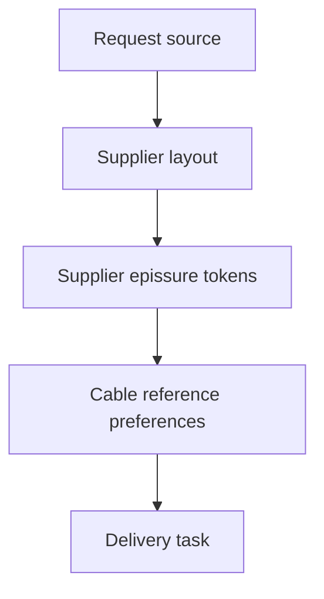

## item_004_aligner_sorties_fdc_sur_format_fournisseur - Aligner sorties FDC sur format fournisseur
> From version: 0.1.0
> Schema version: 1.0
> Status: Done
> Understanding: 88%
> Confidence: 80%
> Progress: 100%
> Complexity: High
> Theme: Supplier output compatibility
> Reminder: Update status/understanding/confidence/progress and linked request/task references when you edit this doc.

# Problem
Les FDC generees remplissent correctement les lignes principales, mais elles ne respectent pas encore toutes les conventions fournisseur attendues.
Les ecarts principaux sont la simplification du gabarit, l'absence de blocs `EXTREMITE 1`/`EXTREMITE 2`, l'absence de rappel faisceau en majuscule, l'absence de colonne `EPI`, un format d'epissures different du format fournisseur et une resolution cable trop dominee par la priorite generique `IR T2 SPB`.

# Scope
- In:
  - adapter le writer FDC pour conserver/recreer les colonnes et fusions fournisseur necessaires ;
  - ajouter les blocs `EXTREMITE 1` et `EXTREMITE 2` ;
  - calculer et afficher le nom de faisceau en majuscule ;
  - ajouter/remplir la colonne `EPI` depuis les epissures detectees ;
  - transformer l'onglet d'epissures vers les tokens fournisseur `FIL*position$` / `FIL*positionY` selon diagnostic ;
  - revoir la resolution cable pour privilegier les references frequentes des combos section/couleur dans les attendus ;
  - enrichir le rapport et ajouter une validation de comparaison sur le jeu du 2026-06-25.
- Out:
  - revenir sur la detection de cote par pin `L`/`R` ;
  - changer le format source des exports fil-a-fil ;
  - ajouter des macros Excel ;
  - figer des preferences cable non justifiees par attendus ou configuration.

# Acceptance criteria
- AC1: La generation conserve ou recree les colonnes/fusions fournisseur structurantes, notamment `DESIGNATION` sur deux colonnes, `APP 2` sur deux colonnes si attendu, `REF CONT FOUR 2` et `COMMENTAIRE` sur deux colonnes quand presentes dans le gabarit.
- AC2: Les blocs `EXTREMITE 1` et `EXTREMITE 2` sont visibles et regroupent respectivement les colonnes de connexion/joint de chaque extremite.
- AC3: Chaque feuille de coupe et feuille d'epissures rappelle le nom du faisceau en majuscule, derive de facon deterministe depuis la source.
- AC4: Une colonne `EPI` existe dans la feuille de coupe et contient l'ID d'epissure concerne pour chaque fil relie a une epissure, vide sinon.
- AC5: Les onglets d'epissures utilisent le numero `FIL` identique a la feuille de coupe et un format de token fournisseur `FIL*position$suffixe`.
- AC6: La regle qui decide `$` versus `Y` est documentee par comparaison aux fichiers attendus ; les cas non conclusifs sont signales dans le rapport.
- AC7: La detection gauche/droite par pin `L`/`R` livree precedemment reste inchangee.
- AC8: La resolution cable privilegie les references les plus frequemment associees aux couples section/couleur dans les attendus fournisseur, avant la priorite generique `IR T2 SPB`.
- AC9: Le rapport de generation indique, pour chaque reference cable choisie, la raison exacte (`expected-frequency`, `explicit-preference`, `fdc-template-preference`, `priority-cable`, `unique`, `ambiguous`, etc.).
- AC10: `npm run check`, `npm run build` et `logics-manager lint --require-status` passent.
- AC11: Une comparaison scriptable entre la sortie generee et les attendus fournisseur verifie au moins les en-tetes, les colonnes `EPI`, les rappels de faisceau, les tokens d'epissures et les references cable sur le fichier de test du 2026-06-25.

# AC Traceability
- request-AC1 -> This backlog slice. Proof: AC1 is the core supplier-template preservation requirement.
- request-AC2 -> This backlog slice. Proof: AC2 covers the visible `EXTREMITE 1` and `EXTREMITE 2` blocks.
- request-AC3 -> This backlog slice. Proof: AC3 covers the uppercase harness-name recall.
- request-AC4 -> This backlog slice. Proof: AC4 covers the `EPI` column and row-level splice recall.
- request-AC5 -> This backlog slice. Proof: AC5 covers supplier epissure token formatting.
- request-AC6 -> This backlog slice. Proof: AC6 requires a documented diagnostic for `$` versus `Y`.
- request-AC7 -> This backlog slice. Proof: AC7 protects the existing corrected L/R behavior.
- request-AC8 -> This backlog slice. Proof: AC8 covers cable references by frequent section/color associations.
- request-AC9 -> This backlog slice. Proof: AC9 makes cable choice reasons auditable.
- request-AC10 -> This backlog slice. Proof: AC10 covers standard validation.
- request-AC11 -> This backlog slice. Proof: AC11 requires comparison against expected supplier output.

# Decision framing
- Product framing: Not needed
- Product signals: supplier acceptance format, operator workbook readability
- Product follow-up: Confirm expected files under `true` are available to the implementation environment.
- Architecture framing: Maybe needed
- Architecture signals: Current code uses positional column indexes and mutates the template structure in `prepareCutSheetWorksheet`.
- Architecture follow-up: Consider a small column-map abstraction before changing template shape.

# Links
- Product brief(s): (none yet)
- Architecture decision(s): (none yet)
- Request: `req_003_aligner_sorties_fdc_sur_format_fournisseur`
- Primary task(s): `task_004_aligner_sorties_fdc_sur_format_fournisseur`

# AI Context
- Summary: Aligner sorties FDC sur format fournisseur.
- Keywords: backlog-groom, request, fdc, fournisseur, extremite, epi, cable-resolution
- Use when: Use when implementing or reviewing supplier-format compatibility for generated FDC outputs.
- Skip when: Skip when the change is unrelated to workbook layout, epissures, or cable references.

# Priority
- Impact: High; supplier acceptance depends on workbook format and expected references, not only on row data.
- Urgency: High; it blocks reliable comparison with the expected `true` outputs.

# Notes
- The local environment did not expose the Windows OneDrive `true` folder; implementation should use those files as soon as mounted or copied into the workspace.
- Start by turning the observed workbook comparison into a reusable scripted check before changing output layout.
- Implemented locally on 2026-06-25 using the versioned supplier template and generated workbook. Exhaustive comparison with `true` remains unavailable until that folder is mounted/copied into the workspace.

# Tasks
- `task_004_aligner_sorties_fdc_sur_format_fournisseur`
