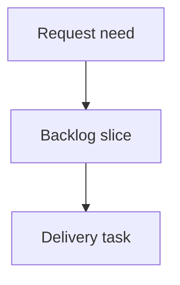

## req_000_pages_epissures_sorties_fdc - Ajouter des pages epissures aux sorties FDC
> From version: 0.1.0
> Schema version: 1.0
> Status: Done
> Understanding: 90%
> Confidence: 85%
> Complexity: Medium
> Theme: Operator workflow
> Reminder: Update status/understanding/confidence and linked backlog/task references when you edit this doc.

# Needs
- Add an epissures worksheet area to every generated FDC workbook.
- For each generated fil-a-fil worksheet, create a linked epissures worksheet that lists detected splices as simple 5-column tables.
- Provide a first structured table output only; graphical splice drawings are explicitly out of scope for this request.

# Context
- The CLI reads AMIPI catalog data, a reference FDC template, and one or more fil-a-fil Excel/CSV exports.
- The generated workbook currently contains one cut-sheet worksheet per source worksheet.
- `README.md` states that the template worksheet named `Epissures`, when present, is removed from generated files.
- Existing code already detects splice endpoints with `isSpliceEndpoint` and applies the `PREDEN 13MM` accessory label on cut-sheet rows.
- Existing fields used for splice grouping are `Begin ID`, `End ID`, `Technical ID`, and `Name`.
- User-provided reference screenshots show graphical splice diagrams, but this request only asks for schematic tables.

# Scope
- In scope: create epissures worksheets associated with generated fil-a-fil cut-sheet worksheets.
- In scope: group wires by splice ID detected from `Begin ID` and `End ID`.
- In scope: write one 5-column table per splice.
- In scope: style the table title, borders, widths, and simple alignment.
- In scope: document the new output in `README.md`.
- Out of scope: drawing connector blocks, lines, arrows, color-coded routes, or graphical Excel shapes.
- Out of scope: changing cable reference resolution rules.
- Out of scope: changing the existing cut-sheet column mapping.

# Desired worksheet behavior
- Create one epissures worksheet for each generated fil-a-fil cut-sheet worksheet.
- Use a worksheet name such as `Epissures - <cut sheet name>` when it fits Excel limits.
- Reuse the existing worksheet-name sanitation and uniqueness rules when the desired name is too long or conflicts.
- Keep the generated cut-sheet worksheets unchanged.
- Do not remove the newly generated epissures worksheets.

# Splice table behavior
- Build one table per splice ID.
- The table has 5 columns.
- The first table row merges columns 1 through 5.
- The merged title cell contains the splice ID.
- The merged title cell is bold and horizontally centered.
- Subsequent rows contain wire labels:
  - column 1 contains wires arriving to the left side of the splice;
  - columns 2, 3, and 4 remain empty for now;
  - column 5 contains wires leaving from the right side of the splice.
- If the splice is found in `End ID`, put the wire on the left side, column 1.
- If the splice is found in `Begin ID`, put the wire on the right side, column 5.
- Use `Technical ID` as the wire label, with `Name` as fallback when `Technical ID` is empty.
- The number of data rows is dynamic and equals the maximum of left-side and right-side wire counts.
- Preserve all wires even when one side has more entries than the other.
- Leave at least two blank rows between splice tables.

# Styling expectations
- Apply thin borders around the cells of each splice table.
- Make columns 1 and 5 wide enough for wire labels.
- Keep columns 2, 3, and 4 narrower as empty spacing columns.
- Vertically center table rows.
- Keep styling simple and compatible with ExcelJS.

# Acceptance criteria
- AC1: A generated workbook keeps all existing cut-sheet worksheets.
- AC2: For each generated cut-sheet worksheet, an associated epissures worksheet is created.
- AC3: Wires connected to the same splice ID are grouped in the same table.
- AC4: Wires where the splice is in `End ID` appear in column 1.
- AC5: Wires where the splice is in `Begin ID` appear in column 5.
- AC6: Each splice table title row is merged across 5 columns, bold, and centered.
- AC7: At least two blank rows separate two splice tables.
- AC8: `npm run check` passes.
- AC9: `npm run build` generates an Excel workbook that can be opened and contains the new epissures worksheets.
- AC10: `README.md` documents the new epissures output.

# Definition of Ready (DoR)
- [x] Problem statement is explicit and user impact is clear.
- [x] Scope boundaries (in/out) are explicit.
- [x] Acceptance criteria are testable.
- [x] Dependencies and known risks are listed.

# Dependencies and risks
- Depends on ExcelJS worksheet creation, merged cells, and styling behavior.
- Depends on the current splice endpoint detection staying correct for source exports.
- Risk: Excel worksheet names are limited to 31 characters, so names must be sanitized and made unique.
- Risk: source exports may contain uneven splice sides; table row count must handle this without dropping wires.

# Companion docs
- Product brief(s): (none yet)
- Architecture decision(s): (none yet)

# References
- `logics_manager/flow.py`
- `logics_manager/assist.py`
- `tests/python/test_logics_manager_cli.py`

# AI Context
- Summary: Draft a bounded request for ajouter des pages epissures aux sorties fdc.
- Keywords: request-draft, logics-manager, python runtime, bundled CLI
- Use when: You need a new bounded request doc for the Logics workflow.
- Skip when: The work already has an existing request or should go straight to a backlog slice.

# Backlog
- `item_001_ajouter_des_pages_epissures_aux_sorties_fdc`
