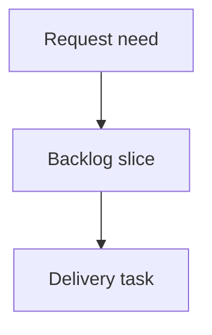

## req_001_ajouter_numerotation_et_traits_aux_epissures - Ajouter numerotation et traits aux epissures
> From version: 0.1.0
> Schema version: 1.0
> Status: Done
> Understanding: 92
> Confidence: 86
> Complexity: Medium
> Theme: Operator workflow
> Reminder: Update status/understanding/confidence and linked backlog/task references when you edit this doc.

# Needs
- Improve the generated epissures worksheets so each splice table is easier to read as a schematic.
- Add a narrow numbering column on each side of the splice table:
  - left side numbers count the wires listed on the left side of the splice, starting at 1;
  - right side numbers count the wires listed on the right side of the splice, starting at 1.
- Keep the output as a simple table-style schematic, but add visual connection lines from each numbered wire row toward a central black splice cell.

# Context
- Task `task_001_ajouter_des_pages_epissures_aux_sorties_fdc` created one epissures worksheet per cut-sheet worksheet.
- Current epissures tables place left-side wires in column 1 and right-side wires in column 5.
- This request refines that worksheet layout; it does not change splice detection or cable resolution.
- Working layout assumption for implementation: each splice table remains 5 columns wide:
  - column 1: narrow left-side wire number;
  - column 2: left-side wire label;
  - column 3: central splice column;
  - column 4: narrow right-side wire number;
  - column 5: right-side wire label.
- The black splice cell should be in column 3, around the middle row of the larger side count: `ceil(max(left wire count, right wire count) / 2)`.
- Lines should connect each numbered row toward the center of the black splice cell:
  - from the right edge of each left-side number cell toward the black center cell;
  - from the left edge of each right-side number cell toward the black center cell.
- Exact Excel line rendering may require validating ExcelJS support or using a compatible workaround that opens correctly in Excel.

# Acceptance criteria
- AC1: Existing epissures worksheets are still generated one per cut-sheet worksheet.
- AC2: Each splice table uses a 5-column layout: left number, left wire label, center splice cell, right number, right wire label.
- AC3: Left-side rows are numbered `1, 2, 3...` independently for wires on the left side of the splice.
- AC4: Right-side rows are numbered `1, 2, 3...` independently for wires on the right side of the splice.
- AC5: The central splice cell in column 3 is filled solid black and placed around the midpoint of the side with the most wires.
- AC6: Visual connection lines are added from each numbered left-side row toward the center of the black splice cell.
- AC7: Visual connection lines are added from each numbered right-side row toward the center of the black splice cell.
- AC8: Existing grouping by splice ID and left/right assignment from `End ID`/`Begin ID` remains unchanged. (SUPERSEDED by `req_002`: left/right is now assigned from the splice-endpoint pin `L`/`R`; grouping by splice ID is unchanged.)
- AC9: The workbook opens in Excel/LibreOffice and the epissures worksheet layout is visible.
- AC10: Documentation or implementation notes explain any limitation or workaround used for Excel line rendering.

# Definition of Ready (DoR)
- [x] Problem statement is explicit and user impact is clear.
- [x] Scope boundaries (in/out) are explicit.
- [x] Acceptance criteria are testable.
- [x] Dependencies and known risks are listed.

# Scope
- In:
  - adjust epissures worksheet table layout
  - add per-side wire numbering
  - add a black central splice cell
  - add visual line connectors or a validated Excel-compatible equivalent
  - preserve existing splice grouping and cut-sheet generation
- Out:
  - changing cable resolution rules
  - changing source export parsing
  - changing cut-sheet worksheet columns
  - drawing full connector blocks, arrows, or a complete graphical harness diagram

# Risks and open points
- ExcelJS may not support arbitrary inserted line shapes well enough for the requested connector lines; implementation must validate support or choose a compatible fallback.
- If a splice has an even maximum side count, the central black row should use the upper middle via `ceil(maxSideCount / 2)` unless implementation notes justify another deterministic choice.

# Companion docs
- Product brief(s): (none yet)
- Architecture decision(s): (none yet)

# References
- `logics_manager/flow.py`
- `logics_manager/assist.py`
- `tests/python/test_logics_manager_cli.py`

# AI Context
- Summary: Draft a bounded request for ajouter numerotation et traits aux epissures.
- Keywords: request-draft, logics-manager, python runtime, bundled CLI
- Use when: You need a new bounded request doc for the Logics workflow.
- Skip when: The work already has an existing request or should go straight to a backlog slice.

# Backlog
- none
- `item_002_ajouter_numerotation_et_traits_aux_epissures`
