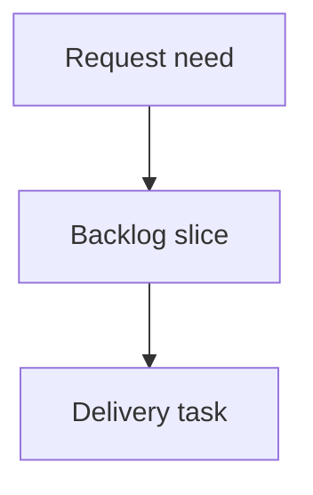

## req_002_corriger_detection_gauche_droite_des_epissures_et_numero_de_fil_affiche - Corriger detection gauche droite des epissures et numero de fil affiche
> From version: 0.1.0
> Schema version: 1.0
> Status: Done
> Understanding: 90%
> Confidence: 85%
> Complexity: Medium
> Theme: Operator workflow
> Reminder: Update status/understanding/confidence and linked backlog/task references when you edit this doc.

# Needs
- Corriger la detection du cote (gauche/droite) des fils d'une epissure dans les onglets `Epissures` generes.
- Afficher dans les tables d'epissures le meme numero de fil que la colonne `FIL` de la feuille de coupe, et non le `Technical ID` complet.
- Ajouter, dans la mise en page 5 colonnes maison existante, une precision visuelle pour les epissures torsadees.

# Context
- Le CLI lit le catalogue AMIPI, une FDC modele et un ou plusieurs exports fil-a-fil, puis genere une feuille de coupe et un onglet `Epissures` associe par onglet source.
- L'export du modeleur encode le cote d'une epissure dans le PIN de l'extremite epissure : la valeur du pin vaut `L` (gauche) ou `R` (droite).
- Le code actuel (`collectSpliceTables`, `src/amipi-cut-wires.mjs`) deduit le cote de la position de l'epissure : epissure dans `End ID` => gauche, dans `Begin ID` => droite. C'est faux.
- Preuve sur l'export `wire-list-faisceau-lat-ral-modeling-2026-06-19_11-53-10.xlsx`, epissure `LAT-EP-01` :
  - sortie actuelle : 1 fil a gauche (`LAT-W-001`), 6 fils a droite ;
  - realite d'apres les pins L/R : 4 fils a gauche (`LAT-W-001`, `-002`, `-026`, `-027`, pin `L`) et 3 a droite (`LAT-W-004`, `-031`, `-003`, pin `R`).
  - L'heuristique Begin/End ne coincide avec les pins que par hasard pour `LAT-EP-02` et `LAT-EP-03` (sens de trace du modeleur), pas par regle.
- Les fils sont actuellement etiquetes par `Technical ID` (`getWireLabel`), ex. `LAT-W-001`, alors que la feuille de coupe affiche le numero `FIL` (entier, ex. `1`) issu de `parseTechnicalIdWireNumber`. L'operateur ne peut pas relier les deux feuilles.
- La donnee `Twist group` (ex. `TOR01`) est deja lue et ecrite dans la colonne TORSADE de la feuille de coupe, mais n'est pas exploitee cote epissure.
- ATTENTION conventions heritees : `req_000` (AC4/AC5) et `req_001` (AC8) documentent explicitement la regle Begin/End erronee. Cette requete corrige cette regle ; la documentation et les AC heritees doivent etre mises a jour en consequence, pas re-validees.
- Hors perimetre confirme par le metier : l'ajout de la reference d'epissure et des manchons associes (details indisponibles), et la signification exacte des marqueurs `$`/`Y` du template AMIPI de reference (a revalider separement, ce n'est pas que la torsade).

# Scope
- In:
  - determiner le cote gauche/droite d'un fil d'epissure a partir du pin `L`/`R` de l'extremite epissure ;
  - afficher le numero de fil (`parseTechnicalIdWireNumber`, identique a la colonne `FIL`) comme etiquette dans les tables d'epissures, avec repli documente si le numero ne peut pas etre extrait ;
  - ajouter une precision visuelle pour les epissures torsadees, deduite de `Twist group`, en conservant la mise en page 5 colonnes maison ;
  - mettre a jour `README.md` et les AC/regles heritees decrivant la detection de cote.
- Out:
  - ajouter la reference d'epissure ou les manchons dans la table d'epissure (details indisponibles) ;
  - reproduire le format de tokens (`fil*pos$/Y`) du template `Epissures` de reference ;
  - changer la mise en page 5 colonnes en autre chose ;
  - changer les regles de resolution cable ou le mapping de colonnes de la feuille de coupe ;
  - changer le parsing des exports source.

# Desired behavior
- Pour chaque fil dont une extremite est une epissure :
  - si le pin de cette extremite vaut `L` => le fil va du cote gauche de l'epissure ;
  - si le pin vaut `R` => le fil va du cote droit ;
  - si le pin n'est ni `L` ni `R` (vide, numerique, 3+ branches) => ne pas deviner : remonter un flag (rapport et/ou colonne commentaire) et appliquer un repli deterministe documente.
- Un fil reliant deux epissures est place dans la table de chaque epissure, du cote indique par le pin de l'extremite correspondante.
- Les etiquettes de fil dans les tables d'epissures sont le numero `FIL` entier, coherent avec la feuille de coupe.
- Les fils torsades sont visuellement distingues dans la table (marqueur, style ou suffixe a definir en tache), sans casser la grille 5 colonnes ni la numerotation par cote.
- La numerotation 1-based independante par cote et par epissure, le regroupement par ID d'epissure, la cellule centrale noire et les traits de liaison restent fonctionnels avec les cotes corriges.

# Analyse: lien numero de fil affiche <-> Technical ID
- Source de verite : la colonne `Technical ID` de l'export (ex. `LAT-W-021`, `PRI-W-001`).
- Le numero de fil affiche (`FIL`, colonne 2 de la feuille de coupe) est derive de `Technical ID` par `parseTechnicalIdWireNumber` : regex `/(?:^|-)W-(\d+)(?:\D*$|$)/i`, qui extrait le bloc de chiffres suivant `W-`. Exemples : `LAT-W-021` -> `21`, `PRI-W-001` -> `1`.
- Cette derivation perd l'information de prefixe (`LAT`/`PRI`, le faisceau) et les zeros de tete : `LAT-W-001` et `PRI-W-001` produisent tous deux `1`. Le numero affiche n'est donc unique qu'a l'interieur d'un meme onglet source ; il n'est pas globalement unique entre faisceaux.
- Le tri des lignes de la feuille de coupe (`compareResolutionsByTechnicalId`) utilise le meme numero extrait ; en cas d'echec d'extraction, repli sur l'ordre de ligne source, et le numero affiche retombe alors sur l'index sequentiel (`wireNumber`) qui peut diverger du `Technical ID`.
- Implication pour cette requete : la table d'epissure doit utiliser exactement la meme valeur que la colonne `FIL` (donc `parseTechnicalIdWireNumber` du meme fil), afin que numero d'epissure et numero de coupe coincident toujours. Reutiliser une fonction commune plutot que recalculer evite toute divergence.
- Risque a tracer : si deux onglets sources (faisceaux differents) sont fusionnes un jour dans une meme vue, le numero `FIL` seul devient ambigu ; le `Technical ID` reste alors la seule cle non ambigue. A surveiller si le perimetre evolue vers du multi-faisceau dans une meme table.

# Acceptance criteria
- AC1: Le cote gauche/droite d'un fil d'epissure est determine par le pin `L`/`R` de l'extremite epissure, pas par la position `Begin ID`/`End ID`.
- AC2: Sur `LAT-EP-01`, la sortie generee place `LAT-W-001`, `-002`, `-026`, `-027` a gauche et `LAT-W-004`, `-031`, `-003` a droite.
- AC3: Un pin qui n'est ni `L` ni `R` ne produit pas de placement devine : un flag est remonte et un repli deterministe documente est applique.
- AC4: Les etiquettes des tables d'epissures affichent le numero `FIL` entier, identique a la colonne 2 de la feuille de coupe du meme fil.
- AC5: Le numero affiche est derive avec la meme logique que la feuille de coupe (`parseTechnicalIdWireNumber`), avec repli documente quand l'extraction echoue.
- AC6: Les fils torsades sont visuellement distingues dans la table d'epissure (marqueur deduit de `Twist group`), en conservant la grille 5 colonnes maison.
- AC7: Regroupement par ID d'epissure, numerotation 1-based par cote, cellule centrale noire et traits de liaison restent fonctionnels avec les cotes corriges.
- AC8: La reference d'epissure et les manchons NE sont PAS ajoutes (hors perimetre).
- AC9: `README.md` et les regles/AC heritees decrivant la detection de cote (`req_000` AC4/AC5, `req_001` AC8) sont mises a jour pour refleter la regle par pin.
- AC10: `npm run check` et `npm run build` passent et le classeur genere s'ouvre avec les onglets d'epissures corriges.

# Definition of Ready (DoR)
- [x] Problem statement is explicit and user impact is clear.
- [x] Scope boundaries (in/out) are explicit.
- [x] Acceptance criteria are testable.
- [x] Dependencies and known risks are listed.

# Dependencies and risks
- Depend de la presence et de la fiabilite du pin `L`/`R` sur les extremites epissure dans les exports.
- Risque : des epissures a 3 branches ou plus (pins hors `L`/`R`) ne tiennent pas dans une grille strictement gauche/droite ; AC3 impose un flag plutot qu'un placement devine.
- Risque : la signification de `$`/`Y` du template AMIPI n'est pas confirmee ; le marqueur torsade s'appuie sur `Twist group`, pas sur ces tokens.
- Risque : ne pas reutiliser une fonction commune pour le numero de fil ferait diverger numero d'epissure et numero de coupe.
- Dette heritee : les AC de `req_000`/`req_001` documentent la regle erronee ; elles doivent etre corrigees pour eviter une re-validation du bug.

# Companion docs
- Product brief(s): (none yet)
- Architecture decision(s): (none yet)

# References
- `src/amipi-cut-wires.mjs`
- `IN/wire-list-faisceau-lat-ral-modeling-2026-06-19_11-53-10.xlsx`
- `data/Fdc_CI1250507 Principal CIRCLE.xlsx`
- `req_000_pages_epissures_sorties_fdc`
- `req_001_ajouter_numerotation_et_traits_aux_epissures`

# AI Context
- Summary: Draft a bounded request for corriger detection gauche droite des epissures et numero de fil affiche.
- Keywords: request-draft, logics-manager, python runtime, bundled CLI
- Use when: You need a new bounded request doc for the Logics workflow.
- Skip when: The work already has an existing request or should go straight to a backlog slice.

# Backlog
- none
- `item_003_corriger_detection_gauche_droite_des_epissures_et_numero_de_fil_affiche`
