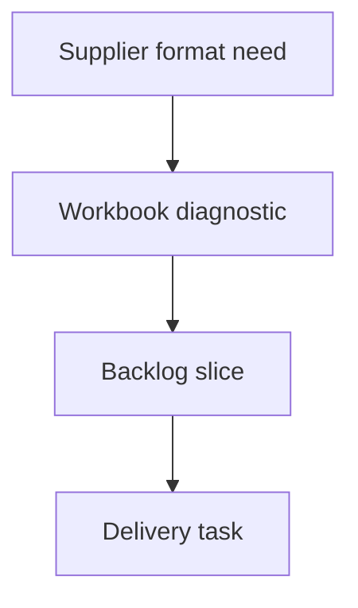

## req_003_aligner_sorties_fdc_sur_format_fournisseur - Aligner sorties FDC sur format fournisseur
> From version: 0.1.0
> Schema version: 1.0
> Status: Done
> Understanding: 88%
> Confidence: 80%
> Complexity: High
> Theme: Supplier output compatibility
> Reminder: Update status/understanding/confidence and linked backlog/task references when you edit this doc.

# Needs
- Aligner le classeur FDC genere avec le format attendu par les fournisseurs, en particulier les blocs `EXTREMITE 1` et `EXTREMITE 2`, le rappel du nom du faisceau en majuscule, la colonne `EPI`, le format fournisseur des epissures et la resolution des references cable.
- Eviter que la generation simplifie le template AMIPI au point de perdre des colonnes ou conventions visibles dans les FDC attendues.
- Rendre le diagnostic et les ecarts tracables pour pouvoir comparer automatiquement une sortie generee avec des fichiers attendus.

# Diagnostic
- Le chemin Windows du dossier `true` n'est pas monte dans cet environnement Linux. Le diagnostic local a donc ete fait avec :
  - sortie generee : `OUT/Fdc_generated_wire-list-faisceau-lat-ral-feux-av-feux-ar-2026-06-25_21-45-50.xlsx` ;
  - modele fournisseur versionne : `data/Fdc_CI1250507 Principal CIRCLE.xlsx` ;
  - catalogue cable : `data/Liste cables AMIPI.xlsx` ;
  - rapport : `OUT/wire-resolution-report.json`.
- Structure FDC :
  - la sortie generee commence directement en ligne 1 avec `DESIGNATION | FIL | SECT | COULEUR | CABLE | LONG | APP 1 | ...` ;
  - le modele fournisseur conserve une structure plus large : `DESIGNATION` fusionne sur `A:B`, `APP 2` fusionne sur `N:O`, colonne `REF CONT FOUR 2`, `COMMENTAIRE` fusionne sur `W:X` ;
  - le code actuel `prepareCutSheetWorksheet` supprime explicitement une colonne 19, defusionne/supprime la deuxieme colonne `DESIGNATION`, defusionne/supprime une colonne `APP 2` et ajoute `Section / couleur plan`. Cette simplification explique une partie des ecarts fournisseur.
- Blocs extremites :
  - les donnees existent deja sous forme de groupes debut/fin (`APP 1`, `VOIE 1`, connexion/joint 1 puis `APP 2`, `VOIE 2`, connexion/joint 2) ;
  - la sortie ne rappelle pas explicitement les blocs fournisseur `EXTREMITE 1` et `EXTREMITE 2`, alors que le format attendu doit pouvoir identifier visuellement les deux extremites et leurs accessoires.
- Nom du faisceau :
  - les onglets generes gardent des noms issus du modeleur, ex. `lateral Wires`, `feu_AV Wires`, `feu_AR Wires` ;
  - le format attendu doit rappeler le nom du faisceau en majuscule dans les feuilles de coupe et dans les feuilles d'epissures, avec une derivee stable depuis le nom d'onglet/source (`LATERAL`, `FEU_AV`, `FEU_AR`, etc.).
- Colonne `EPI` :
  - la sortie actuelle n'a pas de colonne dediee `EPI` ;
  - les epissures sont detectables dans les lignes via `APP 1`/`APP 2` ou les IDs `EP-*`, et via les tables d'epissures ;
  - il faut rappeler sur chaque ligne de coupe l'epissure associee quand une extremite est une epissure, afin que la feuille de coupe et la feuille d'epissures puissent etre relues ensemble.
- Format des epissures :
  - la sortie generee utilise une grille maison 5 colonnes avec labels `FIL` seuls, par exemple `1`, `2`, `26`, `27`, et marqueur torsade `10 (1)` ;
  - le modele fournisseur `Epissures` utilise des tokens compacts du type `fil*position$` et `fil*positionY`, par exemple `3*1$`, `141*1Y` ;
  - le besoin metier signale les mentions `$` "apres diagnostic" : la signification exacte `$`/`Y` doit etre confirmee par comparaison aux attendus, mais la sortie fournisseur attend a minima le rappel `FIL*position` suivi du suffixe approprie.
- References cable :
  - le rapport genere resout les 70 fils, dont 69 par `resolved-by-priority-cable` ;
  - la regle actuelle priorise largement les references `IR T2 SPB` pour les sections `>= 0,5 mm2`, ce qui donne par exemple `0.5|NR -> 104802`, `0.5|RG -> 103523`, `0.5|VE -> 103531`, `0.5|JN -> Z000245903` ;
  - le modele fournisseur montre des associations frequentes section/couleur, mais la logique actuelle ecrase la preference issue du modele par la priorite `IR T2 SPB` ;
  - il faut remplacer la preference "type de cable d'abord" par une strategie fondee sur les references les plus frequemment associees aux couples section/couleur dans les fichiers attendus, avec une priorite explicite et auditable.

# Scope
- In:
  - ajouter ou restaurer dans la FDC les blocs visuels `EXTREMITE 1` et `EXTREMITE 2` sans casser le remplissage actuel des colonnes debut/fin ;
  - conserver les colonnes et fusions fournisseur utiles au lieu de compacter le template sans option ;
  - rappeler le nom du faisceau en majuscule dans les feuilles de coupe et d'epissures ;
  - ajouter une colonne `EPI` alimentee depuis les epissures detectees sur les extremites du fil ;
  - faire evoluer l'onglet d'epissures vers le format fournisseur `FIL*position$suffixe`, avec `$`/`Y` determine par diagnostic documente ;
  - rendre la resolution cable configurable par frequence observee des couples section/couleur/reference dans les FDC attendues ;
  - ajouter un comparateur de structure minimal entre sortie generee et attendus fournisseur quand les fichiers attendus sont disponibles.
- Out:
  - changer le parsing de base des exports fil-a-fil hors ce qui est necessaire pour nommer le faisceau ;
  - supprimer les corrections deja livrees sur le cote gauche/droite par pin `L`/`R` ;
  - imposer une reference cable sans justification dans les donnees attendues ou une table de preference versionnee ;
  - reproduire des macros ou elements Excel non necessaires a la lecture fournisseur.

# Desired behavior
- Une feuille de coupe generee conserve le gabarit fournisseur attendu :
  - colonnes/fusions structurantes preservees ou recreees ;
  - deux blocs clairement identifiables `EXTREMITE 1` et `EXTREMITE 2` ;
  - colonnes accessoires 1/2 remplies comme aujourd'hui ;
  - colonne `EPI` remplie avec l'ID d'epissure concerne, vide sinon.
- Le nom du faisceau est derive de l'onglet source ou du fichier source, normalise en majuscule, et affiche de maniere stable sur la feuille de coupe et l'onglet d'epissures associe.
- L'onglet d'epissures utilise les numeros `FIL` de la FDC et produit les tokens fournisseur :
  - `FIL*position$` pour les cas diagnostiques comme necessitant `$` ;
  - `FIL*positionY` pour les cas diagnostiques comme necessitant `Y` ;
  - si le diagnostic ne peut pas trancher, le suffixe est signale dans un rapport plutot que devine silencieusement.
- Les references cable sont choisies par ordre :
  - preference explicite issue d'une table versionnee ou des fichiers attendus `true` ;
  - reference la plus frequente pour le couple section/couleur dans les FDC attendues ;
  - preference FDC modele ;
  - regle catalogue restante (`IR T2 SPB`, unique match, ambiguite) seulement en repli documente.

# Acceptance criteria
- AC1: La generation conserve ou recree les colonnes/fusions fournisseur structurantes, notamment `DESIGNATION` sur deux colonnes, `APP 2` sur deux colonnes si attendu, `REF CONT FOUR 2` et `COMMENTAIRE` sur deux colonnes quand presentes dans le gabarit.
- AC2: Les blocs `EXTREMITE 1` et `EXTREMITE 2` sont visibles et regroupent respectivement les colonnes de connexion/joint de chaque extremite.
- AC3: Chaque feuille de coupe et feuille d'epissures rappelle le nom du faisceau en majuscule, derive de facon deterministe depuis la source.
- AC4: Une colonne `EPI` existe dans la feuille de coupe et contient l'ID d'epissure concerne pour chaque fil relie a une epissure, vide sinon.
- AC5: Les onglets d'epissures utilisent le numero `FIL` identique a la feuille de coupe et un format de token fournisseur `FIL*position$suffixe`.
- AC6: La regle qui decide `$` versus `Y` est documentee par comparaison aux fichiers attendus ; les cas non conclusifs sont signales dans le rapport.
- AC7: La detection gauche/droite par pin `L`/`R` livree precedemment reste inchangee.
- AC8: La resolution cable privilegie les references les plus frequemment associees aux couples section/couleur dans les attendus fournisseur, avant la priorite generique `IR T2 SPB`.
- AC9: Le rapport de generation indique, pour chaque reference cable choisie, la raison exacte (`expected-frequency`, `explicit-preference`, `fdc-template-preference`, `priority-cable`, `unique`, `ambiguous`, etc.).
- AC10: `npm run check`, `npm run build` et `logics-manager lint --require-status` passent.
- AC11: Une comparaison scriptable entre la sortie generee et les attendus fournisseur verifie au moins les en-tetes, les colonnes `EPI`, les rappels de faisceau, les tokens d'epissures et les references cable sur le fichier de test du 2026-06-25.

# Definition of Ready (DoR)
- [x] Problem statement is explicit and user impact is clear.
- [x] Scope boundaries (in/out) are explicit.
- [x] Acceptance criteria are testable.
- [x] Dependencies and known risks are listed.

# Dependencies and risks
- Depend de l'acces aux fichiers attendus fournisseur sous `true` pour confirmer toutes les conventions `$`/`Y`, `EXTREMITE 1/2` et `EPI`.
- Risque : le modele `data/Fdc_CI1250507 Principal CIRCLE.xlsx` ne contient pas toutes les conventions des attendus `true`; il doit etre traite comme indice, pas comme seule verite si `true` est disponible.
- Risque : restaurer les colonnes/fusions du template peut changer les index de colonnes utilises par `fillFdcRow`; les constantes doivent remplacer les index magiques.
- Risque : les preferences cable par frequence peuvent diverger entre projets; elles doivent etre derivees ou versionnees, pas cachees dans du code implicite.

# Companion docs
- Product brief(s): (none yet)
- Architecture decision(s): (none yet)

# References
- `OUT/Fdc_generated_wire-list-faisceau-lat-ral-feux-av-feux-ar-2026-06-25_21-45-50.xlsx`
- `data/Fdc_CI1250507 Principal CIRCLE.xlsx`
- `data/Liste cables AMIPI.xlsx`
- `OUT/wire-resolution-report.json`
- `src/amipi-cut-wires.mjs`

# AI Context
- Summary: Diagnostiquer et cadrer l'alignement des FDC generees avec les attendus fournisseur.
- Keywords: request-draft, fdc, fournisseur, extremite, epi, epissures, cable-resolution
- Use when: You need to implement or review supplier-format alignment for generated FDC workbooks.
- Skip when: The change is unrelated to generated workbook layout, epissures format, or cable reference selection.

# Backlog
- `item_004_aligner_sorties_fdc_sur_format_fournisseur`
