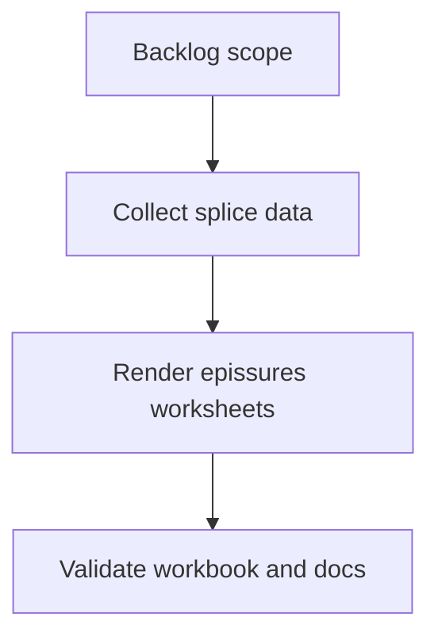

## task_001_ajouter_des_pages_epissures_aux_sorties_fdc - Ajouter des pages epissures aux sorties FDC
> From version: 0.1.0
> Schema version: 1.0
> Status: Done
> Understanding: 90%
> Confidence: 85%
> Progress: 100%
> Complexity: Medium
> Theme: Implementation delivery
> Reminder: Update status/understanding/confidence/progress and linked request/backlog references when you edit this doc.

# Definition of Done (DoD)
- [x] The backlog scope is implemented.
- [x] Acceptance criteria are covered.
- [x] `npm run check` passes.
- [x] `npm run build` passes.
- [x] Generated workbook contains cut-sheet worksheets and linked epissures worksheets.
- [x] `README.md` documents the new epissures output.

# Backlog
- `item_001_ajouter_des_pages_epissures_aux_sorties_fdc`

# Acceptance criteria
- AC1: A generated workbook keeps all existing cut-sheet worksheets.
- AC2: For each generated cut-sheet worksheet, an associated epissures worksheet is created.
- AC3: Wires connected to the same splice ID are grouped in the same table.
- AC4: Wires where the splice is in `End ID` appear in column 1.
- AC5: Wires where the splice is in `Begin ID` appear in column 5.
- AC6: Each splice table title row is merged across 5 columns, bold, and centered.
- AC7: At least two blank rows separate two splice tables.
- AC8: `npm run check` passes.
- AC9: `npm run build` generates an Excel workbook that can be opened and contains the new epissures worksheets.
- AC10: `README.md` documents the new epissures output.

# Validation
- Run `npm run check`.
- Run `npm run build`.
- Inspect the generated workbook structure, preferably with ExcelJS or another scripted check, to confirm epissures worksheets and merged title cells exist.
- Run `logics-manager lint`.
- Run `logics-manager audit --group-by-doc`.
- Run `logics-manager flow closeout task_001_ajouter_des_pages_epissures_aux_sorties_fdc --validation "<validation summary>" --index --lint --audit` after implementation.
- Implemented epissures worksheets per generated cut-sheet worksheet. Validation: npm run check passed; npm run build passed and generated workbook opens with 3 cut-sheet worksheets plus 3 linked epissures worksheets; ExcelJS inspection confirmed merged A:E bold centered title rows, left column 1 wires from End ID splices, right column 5 wires from Begin ID splices, and at least two blank rows between splice tables; logics-manager lint passed; logics-manager audit --group-by-doc passed.
- Finish workflow executed on 2026-06-18.
- Linked backlog/request close verification passed.

# Implementation notes
- Main code file: `src/amipi-cut-wires.mjs`.
- Documentation file: `README.md`.
- Reuse `isSpliceEndpoint` to detect splice endpoints.
- Reuse `makeUniqueWorksheetName` to avoid invalid or duplicate worksheet names.
- Add a collection helper that builds grouped splice data from each sheet's `resolutions`.
- Add a worksheet writer helper that renders the 5-column splice tables with ExcelJS.
- Generate epissures worksheets after cut-sheet worksheets are created and before the workbook is written.
- Keep the current behavior of generated cut-sheet worksheets unchanged.
- Do not implement graphical shapes in this task.

# Suggested implementation steps
- Collect splice data from each resolution using `resolution.wire`.
- For each wire, add a label from `Technical ID` or fallback `Name`.
- If `Begin ID` is a splice endpoint, push the wire label to that splice's right side.
- If `End ID` is a splice endpoint, push the wire label to that splice's left side.
- Create an epissures worksheet named from the cut-sheet worksheet name.
- Set column widths for 5 columns.
- For each splice, merge the title row across columns 1 through 5.
- Fill left labels in column 1 and right labels in column 5.
- Apply borders to the title row and all data rows.
- Insert at least two blank rows before the next splice table.

# Report
- Implementation complete.
- Finished on 2026-06-18.
- Linked backlog item(s): `item_001_ajouter_des_pages_epissures_aux_sorties_fdc`
- Related request(s): `req_000_pages_epissures_sorties_fdc`

# AI Context
- Summary: Implement ajouter des pages epissures aux sorties fdc.
- Keywords: task, implementation, backlog, runtime, python
- Use when: You need a bounded implementation task for a backlog item.
- Skip when: The work is still at the request or backlog shaping stage.

# Links
- Request: `req_000_pages_epissures_sorties_fdc`
- Product brief(s): (none yet)
- Architecture decision(s): (none yet)

# AC Traceability
- request-AC1 -> This task. Proof: Task task_001_ajouter_des_pages_epissures_aux_sorties_fdc carries the same AC1-AC10 acceptance criteria and implementation notes mapping each request criterion to the delivery task; final runtime evidence will be recorded during closeout.
- request-AC2 -> This task. Proof: Task task_001_ajouter_des_pages_epissures_aux_sorties_fdc carries the same AC1-AC10 acceptance criteria and implementation notes mapping each request criterion to the delivery task; final runtime evidence will be recorded during closeout.
- request-AC3 -> This task. Proof: Task task_001_ajouter_des_pages_epissures_aux_sorties_fdc carries the same AC1-AC10 acceptance criteria and implementation notes mapping each request criterion to the delivery task; final runtime evidence will be recorded during closeout.
- request-AC4 -> This task. Proof: Task task_001_ajouter_des_pages_epissures_aux_sorties_fdc carries the same AC1-AC10 acceptance criteria and implementation notes mapping each request criterion to the delivery task; final runtime evidence will be recorded during closeout.
- request-AC5 -> This task. Proof: Task task_001_ajouter_des_pages_epissures_aux_sorties_fdc carries the same AC1-AC10 acceptance criteria and implementation notes mapping each request criterion to the delivery task; final runtime evidence will be recorded during closeout.
- request-AC6 -> This task. Proof: Task task_001_ajouter_des_pages_epissures_aux_sorties_fdc carries the same AC1-AC10 acceptance criteria and implementation notes mapping each request criterion to the delivery task; final runtime evidence will be recorded during closeout.
- request-AC7 -> This task. Proof: Task task_001_ajouter_des_pages_epissures_aux_sorties_fdc carries the same AC1-AC10 acceptance criteria and implementation notes mapping each request criterion to the delivery task; final runtime evidence will be recorded during closeout.
- request-AC8 -> This task. Proof: Task task_001_ajouter_des_pages_epissures_aux_sorties_fdc carries the same AC1-AC10 acceptance criteria and implementation notes mapping each request criterion to the delivery task; final runtime evidence will be recorded during closeout.
- request-AC9 -> This task. Proof: Task task_001_ajouter_des_pages_epissures_aux_sorties_fdc carries the same AC1-AC10 acceptance criteria and implementation notes mapping each request criterion to the delivery task; final runtime evidence will be recorded during closeout.
- request-AC10 -> This task. Proof: Task task_001_ajouter_des_pages_epissures_aux_sorties_fdc carries the same AC1-AC10 acceptance criteria and implementation notes mapping each request criterion to the delivery task; final runtime evidence will be recorded during closeout.
