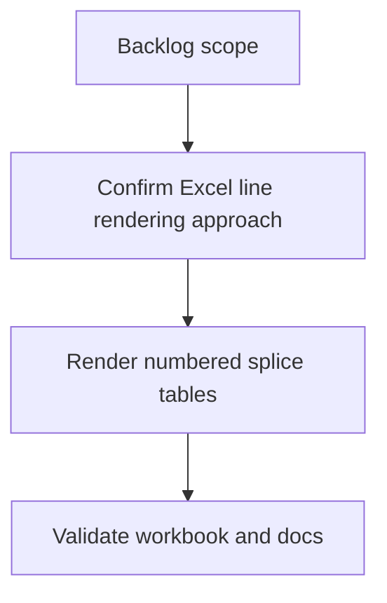

## task_002_ajouter_numerotation_et_traits_aux_epissures - Ajouter numerotation et traits aux epissures
> From version: 0.1.0
> Schema version: 1.0
> Status: Done
> Understanding: 90%
> Confidence: 85%
> Progress: 100%
> Complexity: Medium
> Theme: Implementation delivery
> Reminder: Update status/understanding/confidence/progress and linked request/backlog references when you edit this doc.

# Definition of Done (DoD)
- [x] The backlog scope is implemented.
- [x] Acceptance criteria are covered.
- [x] `npm run check` passes.
- [x] `npm run build` passes.
- [x] Generated workbook contains cut-sheet worksheets and linked epissures worksheets with numbered sides and black center cells.
- [x] Connector line rendering is validated in the generated workbook or an explicit compatible fallback is documented.
- [x] `README.md` or implementation notes document the refined epissures output.

# Backlog
- `item_002_ajouter_numerotation_et_traits_aux_epissures`

# Acceptance criteria
- AC1: Existing epissures worksheets are still generated one per cut-sheet worksheet.
- AC2: Each splice table uses a 5-column layout: left number, left wire label, center splice cell, right number, right wire label.
- AC3: Left-side rows are numbered `1, 2, 3...` independently for wires on the left side of the splice.
- AC4: Right-side rows are numbered `1, 2, 3...` independently for wires on the right side of the splice.
- AC5: The central splice cell in column 3 is filled solid black and placed around the midpoint of the side with the most wires.
- AC6: Visual connection lines are added from each numbered left-side row toward the center of the black splice cell.
- AC7: Visual connection lines are added from each numbered right-side row toward the center of the black splice cell.
- AC8: Existing grouping by splice ID and left/right assignment from `End ID`/`Begin ID` remains unchanged.
- AC9: The workbook opens in Excel/LibreOffice and the epissures worksheet layout is visible.
- AC10: Documentation or implementation notes explain any limitation or workaround used for Excel line rendering.

# Validation
- Run `npm run check`.
- Run `npm run build`.
- Inspect the generated workbook structure with ExcelJS or another scripted check:
  - cut-sheet worksheets still exist;
  - one epissures worksheet exists for each cut-sheet worksheet;
  - number columns are populated independently on left and right sides;
  - column 3 contains a solid black cell on the expected center row for each splice table.
- Open or otherwise validate the generated workbook visual output to confirm connector lines or the documented fallback render as intended.
- Run `logics-manager lint`.
- Run `logics-manager audit --group-by-doc`.
- Run `logics-manager flow closeout task_002_ajouter_numerotation_et_traits_aux_epissures --validation "<validation summary>" --index --lint --audit` after implementation.
- Implemented refined epissures layout. Validation: npm run check passed; npm run build passed; generated workbook opens via ExcelJS with 3 cut-sheet worksheets and 3 linked epissures worksheets; scripted inspection confirmed 5-column numbered layout, independent left/right numbering, solid black center cell on ceil(max side count / 2), connector borders for numbered rows, and two blank rows between splice tables. README documents the connector-line fallback as Excel borders because ExcelJS does not provide arbitrary line-shape insertion for this workbook path. logics-manager lint passed; logics-manager audit --group-by-doc passed.
- Finish workflow executed on 2026-06-18.
- Linked backlog/request close verification passed.

# Implementation notes
- Main code file: `src/amipi-cut-wires.mjs`.
- Documentation file: `README.md`.
- Build on the epissures helpers added for `task_001_ajouter_des_pages_epissures_aux_sorties_fdc`.
- Keep `collectSpliceTables` grouping behavior unchanged unless a small shape-specific data structure is needed.
- Update `writeEpissureWorksheet` to render each splice table as:
  - column 1: narrow left-side row number;
  - column 2: left-side wire label;
  - column 3: central splice marker;
  - column 4: narrow right-side row number;
  - column 5: right-side wire label.
- Use independent 1-based numbering per side and per splice table.
- Compute the black center row with `Math.ceil(Math.max(left.length, right.length, 1) / 2)` relative to the table data rows.
- Fill the center marker cell solid black.
- Investigate ExcelJS support for drawing line shapes. If unsupported, use the smallest compatible visual alternative and document the tradeoff before closeout.
- Preserve at least two blank rows between splice tables.

# Suggested implementation steps
- Confirm how ExcelJS writes or preserves drawing shapes in `.xlsx`.
- Adjust epissures column widths so number columns are narrow and wire-label columns remain readable.
- Add left and right side numbering while preserving empty cells for uneven side counts.
- Add the central black cell to the computed center row.
- Add connector lines or the selected fallback visual from numbered rows to the center marker.
- Extend README output documentation.
- Validate with a generated workbook and scripted checks.

# Report
- Implementation complete.
- Finished on 2026-06-18.
- Linked backlog item(s): `item_002_ajouter_numerotation_et_traits_aux_epissures`
- Related request(s): `req_001_ajouter_numerotation_et_traits_aux_epissures`

# AI Context
- Summary: Implement ajouter numerotation et traits aux epissures.
- Keywords: task, implementation, backlog, runtime, python
- Use when: You need a bounded implementation task for a backlog item.
- Skip when: The work is still at the request or backlog shaping stage.

# Links
- Request: `req_001_ajouter_numerotation_et_traits_aux_epissures`
- Product brief(s): (none yet)
- Architecture decision(s): (none yet)

# AC Traceability
- request-AC1 -> This task. Proof: Task AC1 and DoD require the existing one-epissures-worksheet-per-cut-sheet behavior to remain covered during implementation.
- request-AC2 -> This task. Proof: Task AC2 and implementation notes define the refined 5-column splice table layout.
- request-AC3 -> This task. Proof: Task AC3 and implementation notes require independent left-side 1-based numbering.
- request-AC4 -> This task. Proof: Task AC4 and implementation notes require independent right-side 1-based numbering.
- request-AC5 -> This task. Proof: Task AC5 and implementation notes define the black center marker cell and its midpoint placement rule.
- request-AC6 -> This task. Proof: Task AC6 and validation require left-side connector rendering toward the central black cell.
- request-AC7 -> This task. Proof: Task AC7 and validation require right-side connector rendering toward the central black cell.
- request-AC8 -> This task. Proof: Task AC8 explicitly preserves existing grouping by splice ID and side assignment from `End ID`/`Begin ID`.
- request-AC9 -> This task. Proof: Task AC9 and validation require the generated workbook to open with visible epissures layout.
- request-AC10 -> This task. Proof: Task AC10, DoD, and implementation notes require documentation of any Excel line-rendering limitation or workaround.
