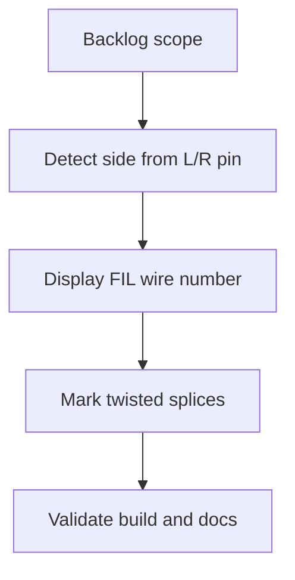

## task_003_corriger_detection_gauche_droite_des_epissures_et_numero_de_fil_affiche - Corriger detection gauche droite des epissures et numero de fil affiche
> From version: 0.1.0
> Schema version: 1.0
> Status: Done
> Understanding: 90%
> Confidence: 85%
> Progress: 100%
> Complexity: Medium
> Theme: Implementation delivery
> Reminder: Update status/understanding/confidence/progress and linked request/backlog references when you edit this doc.

# Definition of Done (DoD)
- [x] The backlog scope is implemented.
- [x] Acceptance criteria are covered.
- [x] Validation passes.

# Implementation notes
- Fichier modifie: `src/amipi-cut-wires.mjs`.
- Cote gauche/droite: nouvelle fonction `spliceSideFromPin` (`L`=>left, `R`=>right). `collectSpliceTables` lit le pin de l'extremite epissure (`Begin pin`/`End pin`) au lieu de la position `Begin ID`/`End ID`.
- Pin hors `L`/`R`: repli deterministe (Begin=>right, End=>left) + flag structure remonte (`collectSpliceTables` -> `writeEpissureWorksheet` -> `writeCutSheetWorkbook` -> rapport `spliceSideFlags`) et `console.warn` au build.
- Numero de fil: `clearAndFillCutSheetWorksheet` attache `resolution.displayWireNumber` (= valeur de la colonne FIL); `spliceWireEntry` reutilise cette valeur comme etiquette d'epissure. Repli `parseTechnicalIdWireNumber` puis `getWireLabel`.
- Torsade: `spliceWireEntry` deduit `twisted` de `Twist group`; `writeEpissureWireCell` affiche `N (TORxx)` en gras italique; le titre de l'epissure est suffixe ` (torsadé)` si un fil est torsade.
- Hors perimetre respecte: aucune reference d'epissure ni manchon ajoute; mise en page 5 colonnes maison conservee.
- Doc: `README.md` mis a jour; AC heritees `req_000` (AC4/AC5 + comportement) et `req_001` (AC8) annotees SUPERSEDED.

# Backlog
- `item_003_corriger_detection_gauche_droite_des_epissures_et_numero_de_fil_affiche`

# Acceptance criteria
- AC1: Le cote gauche/droite d'un fil d'epissure est determine par le pin `L`/`R` de l'extremite epissure, pas par la position `Begin ID`/`End ID`.
- AC2: Sur `LAT-EP-01`, la sortie generee place `LAT-W-001`, `-002`, `-026`, `-027` a gauche et `LAT-W-004`, `-031`, `-003` a droite.
- AC3: Un pin qui n'est ni `L` ni `R` ne produit pas de placement devine : un flag est remonte et un repli deterministe documente est applique.
- AC4: Les etiquettes des tables d'epissures affichent le numero `FIL` entier, identique a la colonne 2 de la feuille de coupe du meme fil.
- AC5: Le numero affiche est derive avec la meme logique que la feuille de coupe (`parseTechnicalIdWireNumber`), avec repli documente quand l'extraction echoue.
- AC6: Les fils torsades sont visuellement distingues dans la table d'epissure (marqueur deduit de `Twist group`), en conservant la grille 5 colonnes maison.
- AC7: Regroupement par ID d'epissure, numerotation 1-based par cote, cellule centrale noire et traits de liaison restent fonctionnels avec les cotes corriges.
- AC8: La reference d'epissure et les manchons NE sont PAS ajoutes (hors perimetre).
- AC9: `README.md` et les regles/AC heritees decrivant la detection de cote (`req_000` AC4/AC5, `req_001` AC8) sont mises a jour pour refleter la regle par pin.
- AC10: `npm run check` et `npm run build` passent et le classeur genere s'ouvre avec les onglets d'epissures corriges.

# Validation
- Run `python3 -m logics_manager lint --require-status`.
- Run `python3 -m logics_manager flow finish task task_003_corriger_detection_gauche_droite_des_epissures_et_numero_de_fil_affiche.md` after implementation.
- npm run check OK; npm run build OK (160 lignes, 0 regression de resolution). Verifie sur LAT-EP-01: gauche=FIL 1,2,26,27 (pin L), droite=FIL 4,31,3 (pin R), conforme AC2. Etiquettes = numero FIL identique a la feuille de coupe. Test synthetique: marqueur torsade (italique gras + (TORxx) + titre (torsadé)) et flag pin-inconnu remonte dans spliceSideFlags + console.warn, avec repli deterministe. README et AC heritees (req_000 AC4/AC5, req_001 AC8) mises a jour.
- Finish workflow executed on 2026-06-19.
- Linked backlog/request close verification passed.

# Report
- Implementation complete.
- Finished on 2026-06-19.
- Linked backlog item(s): `item_003_corriger_detection_gauche_droite_des_epissures_et_numero_de_fil_affiche`
- Related request(s): `req_002_corriger_detection_gauche_droite_des_epissures_et_numero_de_fil_affiche`

# AI Context
- Summary: Implement corriger detection gauche droite des epissures et numero de fil affiche.
- Keywords: task, implementation, backlog, runtime, python
- Use when: You need a bounded implementation task for a backlog item.
- Skip when: The work is still at the request or backlog shaping stage.

# Links
- Request: `req_002_corriger_detection_gauche_droite_des_epissures_et_numero_de_fil_affiche`
- Product brief(s): (none yet)
- Architecture decision(s): (none yet)

# AC Traceability
- request-AC1 -> This task. Proof: Couvert par task_003: detection cote par pin L/R (AC1-AC3), numero FIL via parseTechnicalIdWireNumber (AC4-AC5), marqueur torsade en grille 5 colonnes (AC6), regroupement/numerotation/centre/traits preserves (AC7), reference epissure hors perimetre (AC8), doc et AC heritees mises a jour (AC9), npm run check et build verts (AC10).
- request-AC2 -> This task. Proof: Couvert par task_003: detection cote par pin L/R (AC1-AC3), numero FIL via parseTechnicalIdWireNumber (AC4-AC5), marqueur torsade en grille 5 colonnes (AC6), regroupement/numerotation/centre/traits preserves (AC7), reference epissure hors perimetre (AC8), doc et AC heritees mises a jour (AC9), npm run check et build verts (AC10).
- request-AC3 -> This task. Proof: Couvert par task_003: detection cote par pin L/R (AC1-AC3), numero FIL via parseTechnicalIdWireNumber (AC4-AC5), marqueur torsade en grille 5 colonnes (AC6), regroupement/numerotation/centre/traits preserves (AC7), reference epissure hors perimetre (AC8), doc et AC heritees mises a jour (AC9), npm run check et build verts (AC10).
- request-AC4 -> This task. Proof: Couvert par task_003: detection cote par pin L/R (AC1-AC3), numero FIL via parseTechnicalIdWireNumber (AC4-AC5), marqueur torsade en grille 5 colonnes (AC6), regroupement/numerotation/centre/traits preserves (AC7), reference epissure hors perimetre (AC8), doc et AC heritees mises a jour (AC9), npm run check et build verts (AC10).
- request-AC5 -> This task. Proof: Couvert par task_003: detection cote par pin L/R (AC1-AC3), numero FIL via parseTechnicalIdWireNumber (AC4-AC5), marqueur torsade en grille 5 colonnes (AC6), regroupement/numerotation/centre/traits preserves (AC7), reference epissure hors perimetre (AC8), doc et AC heritees mises a jour (AC9), npm run check et build verts (AC10).
- request-AC6 -> This task. Proof: Couvert par task_003: detection cote par pin L/R (AC1-AC3), numero FIL via parseTechnicalIdWireNumber (AC4-AC5), marqueur torsade en grille 5 colonnes (AC6), regroupement/numerotation/centre/traits preserves (AC7), reference epissure hors perimetre (AC8), doc et AC heritees mises a jour (AC9), npm run check et build verts (AC10).
- request-AC7 -> This task. Proof: Couvert par task_003: detection cote par pin L/R (AC1-AC3), numero FIL via parseTechnicalIdWireNumber (AC4-AC5), marqueur torsade en grille 5 colonnes (AC6), regroupement/numerotation/centre/traits preserves (AC7), reference epissure hors perimetre (AC8), doc et AC heritees mises a jour (AC9), npm run check et build verts (AC10).
- request-AC8 -> This task. Proof: Couvert par task_003: detection cote par pin L/R (AC1-AC3), numero FIL via parseTechnicalIdWireNumber (AC4-AC5), marqueur torsade en grille 5 colonnes (AC6), regroupement/numerotation/centre/traits preserves (AC7), reference epissure hors perimetre (AC8), doc et AC heritees mises a jour (AC9), npm run check et build verts (AC10).
- request-AC9 -> This task. Proof: Couvert par task_003: detection cote par pin L/R (AC1-AC3), numero FIL via parseTechnicalIdWireNumber (AC4-AC5), marqueur torsade en grille 5 colonnes (AC6), regroupement/numerotation/centre/traits preserves (AC7), reference epissure hors perimetre (AC8), doc et AC heritees mises a jour (AC9), npm run check et build verts (AC10).
- request-AC10 -> This task. Proof: Couvert par task_003: detection cote par pin L/R (AC1-AC3), numero FIL via parseTechnicalIdWireNumber (AC4-AC5), marqueur torsade en grille 5 colonnes (AC6), regroupement/numerotation/centre/traits preserves (AC7), reference epissure hors perimetre (AC8), doc et AC heritees mises a jour (AC9), npm run check et build verts (AC10).
