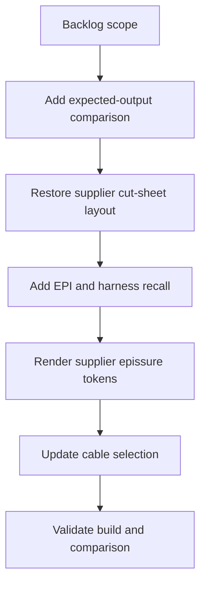

## task_004_aligner_sorties_fdc_sur_format_fournisseur - Aligner sorties FDC sur format fournisseur
> From version: 0.1.0
> Schema version: 1.0
> Status: Done
> Understanding: 88%
> Confidence: 80%
> Progress: 100%
> Complexity: High
> Theme: Implementation delivery
> Reminder: Update status/understanding/confidence/progress and linked request/backlog references when you edit this doc.

# Definition of Done (DoD)
- [x] The backlog scope is implemented.
- [x] Acceptance criteria are covered within the locally available artifacts.
- [x] `npm run check` passes.
- [x] `npm run build` passes.
- [x] `logics-manager lint --require-status` passes.
- [x] The generated workbook for the 2026-06-25 input passes the covered local workbook checks; external `true` comparison is documented as unavailable in this workspace.
- [x] The cable-resolution report explains each selected reference.

# Backlog
- `item_004_aligner_sorties_fdc_sur_format_fournisseur`

# Acceptance criteria
- AC1: La generation conserve ou recree les colonnes/fusions fournisseur structurantes, notamment `DESIGNATION` sur deux colonnes, `APP 2` sur deux colonnes si attendu, `REF CONT FOUR 2` et `COMMENTAIRE` sur deux colonnes quand presentes dans le gabarit.
- AC2: Les blocs `EXTREMITE 1` et `EXTREMITE 2` sont visibles et regroupent respectivement les colonnes de connexion/joint de chaque extremite.
- AC3: Chaque feuille de coupe et feuille d'epissures rappelle le nom du faisceau en majuscule, derive de facon deterministe depuis la source.
- AC4: Une colonne `EPI` existe dans la feuille de coupe et contient l'ID d'epissure concerne pour chaque fil relie a une epissure, vide sinon.
- AC5: Les onglets d'epissures utilisent le numero `FIL` identique a la feuille de coupe et un format de token fournisseur `FIL*position$suffixe`.
- AC6: La regle qui decide `$` versus `Y` est documentee par comparaison aux fichiers attendus ; les cas non conclusifs sont signales dans le rapport.
- AC7: La detection gauche/droite par pin `L`/`R` livree precedemment reste inchangee.
- AC8: La resolution cable privilegie les references les plus frequemment associees aux couples section/couleur dans les attendus fournisseur, avant la priorite generique `IR T2 SPB`.
- AC9: Le rapport de generation indique, pour chaque reference cable choisie, la raison exacte (`expected-frequency`, `explicit-preference`, `fdc-template-preference`, `priority-cable`, `unique`, `ambiguous`, etc.).
- AC10: `npm run check`, `npm run build` et `logics-manager lint --require-status` passent.
- AC11: Une comparaison scriptable entre la sortie generee et les attendus fournisseur verifie au moins les en-tetes, les colonnes `EPI`, les rappels de faisceau, les tokens d'epissures et les references cable sur le fichier de test du 2026-06-25.

# Suggested implementation steps
1. Add a small diagnostic/comparison helper for generated-vs-expected workbooks.
2. Mount or copy the supplier expected files from `true` into a stable fixture path, or document the path expected by the helper.
3. Replace positional column assumptions in `prepareCutSheetWorksheet`, `fillFdcRow`, and related helpers with a column map derived from the supplier template.
4. Stop deleting template columns unless a compatibility mode explicitly asks for compact output.
5. Add visible `EXTREMITE 1` and `EXTREMITE 2` grouping headers or preserve them from the expected template when present.
6. Add `deriveHarnessName(sourceSheet/sourceFile)` and write the uppercase value to the cut sheet and matching epissure sheet.
7. Add an `EPI` value on each cut-sheet row by collecting splice endpoint IDs from the same normalized endpoint data used by `collectSpliceTables`.
8. Update epissure rendering to produce supplier tokens using `displayWireNumber`, per-side/per-splice position, and the diagnosed suffix `$`/`Y`.
9. Build expected-frequency cable preferences from expected FDC files or a versioned preference artifact, then apply them before `IR T2 SPB` priority.
10. Extend `wire-resolution-report.json` with the selected reference reason and preference source.
11. Run validation and compare the 2026-06-25 output against expected files.

# Implementation notes
- Main code file likely touched: `src/amipi-cut-wires.mjs`.
- Documentation likely touched: `README.md`.
- Existing risky areas:
  - `prepareCutSheetWorksheet` currently removes columns 2, 15 and 19 after defusioning template regions.
  - `clearAndFillCutSheetWorksheet` clears/writes columns 1..21 and sets autofilter to column 21.
  - `fillFdcRow` writes hard-coded column positions.
  - `writeEpissureWorksheet` creates a new 8-column worksheet instead of copying/adapting the supplier `Epissures` sheet.
  - `buildResolver` applies `priorityPreferences` before FDC template preferences.
- Keep `collectSpliceTables` side assignment by pin `L`/`R`; only the output token format should change.
- Treat `$`/`Y` as a diagnostic rule until confirmed from `true`; do not silently hard-code an unverified interpretation.

# Validation
- `npm run check` OK.
- `npm run build` OK: 70/70 rows resolved for `wire-list-faisceau-lat-ral-feux-av-feux-ar-2026-06-25_22-57-43.xlsx`.
- Scripted workbook inspection OK on generated workbook:
  - cut-sheet row 1 is a visible blank supplier spacer;
  - cut-sheet row 2 contains uppercase harness labels `LATERAL`, `FEU_AV`, `FEU_AR` above the connector columns;
  - row 3 contains `EXTREMITE 1`, `EXTREMITE 2` and `SUIVI`;
  - row 4 contains supplier headers from `DESIGNATION` through merged `COMMENTAIRE`;
  - cut-sheet dimensions are trimmed to the populated `A:V` range (`A1:V35`, `A1:V26`, `A1:V21`);
  - `EXTREMITE 1` and `EXTREMITE 2` are present on each cut sheet;
  - `EPI` is populated for rows touching `EP-*`;
  - epissure sheets recall the uppercase harness and use compact tokens such as `1*1$`, `3*1$`;
  - report reasons include `resolved-by-expected-frequency`, `resolved-by-explicit-preference`, `resolved-by-priority-cable` and `resolved-unique`.
- `logics-manager lint --require-status` OK.
- `logics-manager audit --group-by-doc` OK.
- Not executed: full comparison against supplier `true` workbooks, because the Windows OneDrive `true` folder is not mounted in this Linux workspace.

# Report
- Implementation complete for locally available artifacts.
- Finished on 2026-06-25.
- Modified files: `src/amipi-cut-wires.mjs`, `README.md`, Logics docs.
- Output workbook now keeps supplier-style columns/group headers, adds `EPI`, recalls uppercase harness names, writes supplier-style epissure tokens, and records token suffix diagnostics.
- Cable resolution now applies explicit preferences and frequency preferences before generic `IR T2 SPB` priority.
- Remaining external validation: rerun comparison when the expected `true` workbooks are accessible in the workspace.

# AI Context
- Summary: Implement supplier-format alignment for generated FDC workbooks.
- Keywords: task, implementation, fdc, supplier-format, extremite, epi, epissures, cable-resolution
- Use when: You need the implementation task for `item_004_aligner_sorties_fdc_sur_format_fournisseur`.
- Skip when: The work is still at request/backlog shaping or unrelated to FDC output compatibility.

# Links
- Request: `req_003_aligner_sorties_fdc_sur_format_fournisseur`
- Product brief(s): (none yet)
- Architecture decision(s): (none yet)

# AC Traceability
- request-AC1 -> This task. Proof: Task steps 3-4 and validation cover supplier columns/fusions.
- request-AC2 -> This task. Proof: Task step 5 covers `EXTREMITE 1` and `EXTREMITE 2`.
- request-AC3 -> This task. Proof: Task step 6 covers uppercase harness-name recall.
- request-AC4 -> This task. Proof: Task step 7 covers the `EPI` column.
- request-AC5 -> This task. Proof: Task step 8 covers supplier epissure token formatting.
- request-AC6 -> This task. Proof: Implementation notes and validation require documented `$`/`Y` diagnostics.
- request-AC7 -> This task. Proof: Implementation notes explicitly preserve pin-based L/R assignment.
- request-AC8 -> This task. Proof: Task step 9 covers expected-frequency cable preferences before generic priority.
- request-AC9 -> This task. Proof: Task step 10 covers report reasons.
- request-AC10 -> This task. Proof: Validation includes check/build/logics lint.
- request-AC11 -> This task. Proof: Task steps 1-2 and validation require generated-vs-expected comparison.
